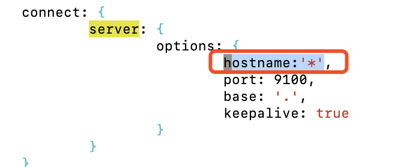

# 安装head插件

## 前言  

head插件是es的集群管理工具，可用于数据的浏览和查询。

## 安装

### 安装Node
```
wget https://nodejs.org/download/release/v10.16.1/node-v10.16.1-linux-x64.tar.gz
tar -xzvf node-v10.16.1-linux-x64.tar.gz -C /opt/

```

* 编辑环境变量文件/etc/profile

```
export NODE_HOME=/opt/node-v10.16.1-linux-x64/
export NODE_PATH=$NODE_HOME/lib/node_modules 
export PATH=$PATH:$NODE_HOME/bin  
```
* 设置国内npm 源头

```
npm config set registry https://registry.npm.taobao.org
npm config get registry
```

### 安装head 

* 补充配置node 

```bash
mkdir ~/.npm-global
npm config set prefix '~/.npm-global'

```

* vi /etc/profile  文件末尾追加  
```BASH
# nodejs 配置
export PATH=~/.npm-global/bin:$PATH
```

*  激活环境变量配置``source /etc/profile``


* 下载安装
```bash
yum install git -y 
git clone git://github.com/mobz/elasticsearch-head.git
cd elasticsearch-head
npm install -g grunt-cli
npm install
# npm run start
```

* vim Gruntfile.js ,编辑connect.server.options下面添加``hostname:'*',``




* vim _site/app.js修改连接es地址 

```bash
# 原来内容 localhost 配置成为es的IP地址
# this.base_uri = this.config.base_uri || this.prefs.get("app-base_uri") || "http://localhost:9200";
# 修改后内容
this.base_uri = this.config.base_uri || this.prefs.get("app-base_uri") || "http://192.168.30.11:9200";
```


* 启动head 

```bash
node_modules/grunt/bin/grunt server
# 访问该地址，可以通过head查看es的运行状况
# http://192.168.30.11:9100/
```
