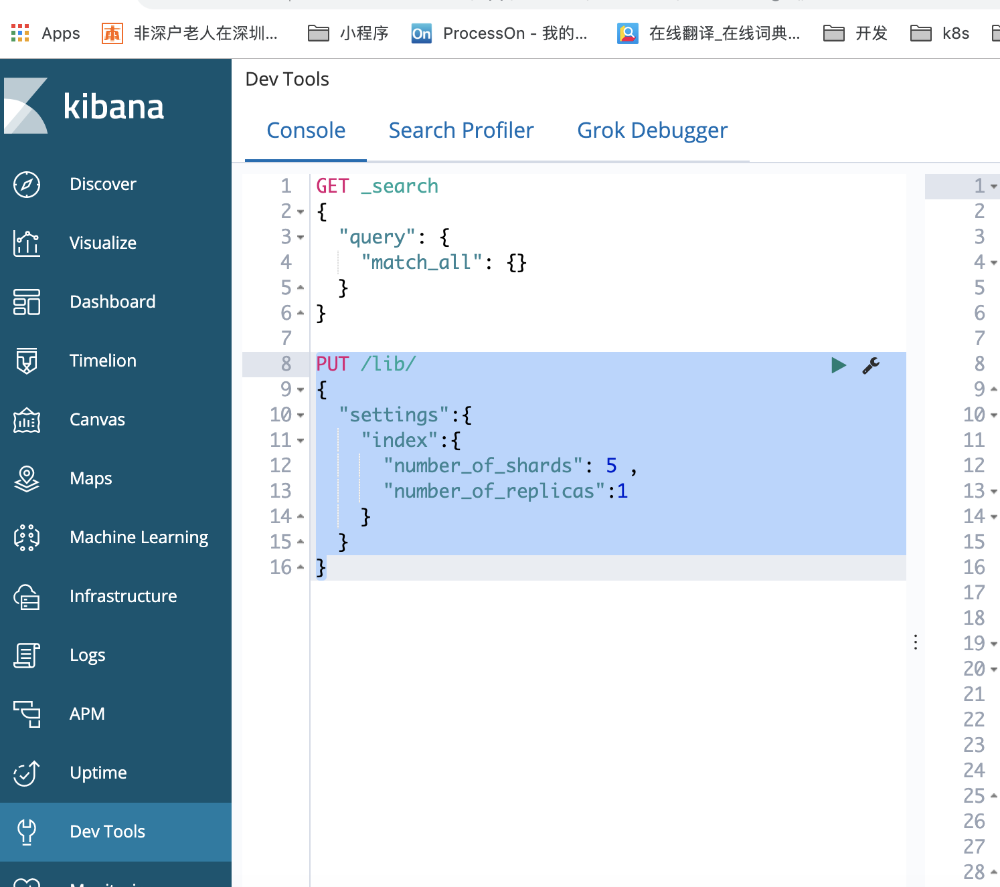

# 使用kabana

## 说明

kabana有devtools,使用它操作es比直接用curl更方便。



## 操作

* 添加索引  
```BASH
PUT /lib/
{
  "settings":{
    "index":{
      "number_of_shards": 5 ,
      "number_of_replicas":1
    }
  }
}
```
> lib 索引名
> number_of_shards 分片数，添加后不能修改
> number_of_replicas 备份数1


* 查看索引配置

```bash
GET /lib/_settings
# 查看所有索引的数据
GET _all/_settings
```


* 添加文档

```bash
PUT /lib/user/1
{
  "first_name": "Nick",
  "last_name": "Qiu",
  "age": 20,
  "about": "I lick nick qiu",
  "interests": ["music","basketball"]
}
# 没有指定ID，由ES生成
POST /lib/user/
{
  "first_name": "邱家洪",
  "last_name": "Qiu",
  "age": 20,
  "about": "I lick nick qiu",
  "interests": ["music","basketball"]
}
```

> user  -- 文档
> 1     -- ID 


* 获取文档

```bash
GET /lib/user/1
# 只查看部分数据
GET /lib/user/1?_source=age,about
```


* 修改文档 

```bash
# 覆盖更新
PUT /lib/user/1
{
  "first_name": "Nick",
  "last_name": "Qiu",
  "age": 40,
  "about": "I lick nick qiu",
  "interests": ["music","basketball"]
}
# 直接更新
POST /lib/user/1/_update
{
  "doc":{
    "age": 22
  }
}
```

* 删除 

```bash
# 删除记录
DELETE /lib/user/1
# 删除索引 
DELETE /lib
```